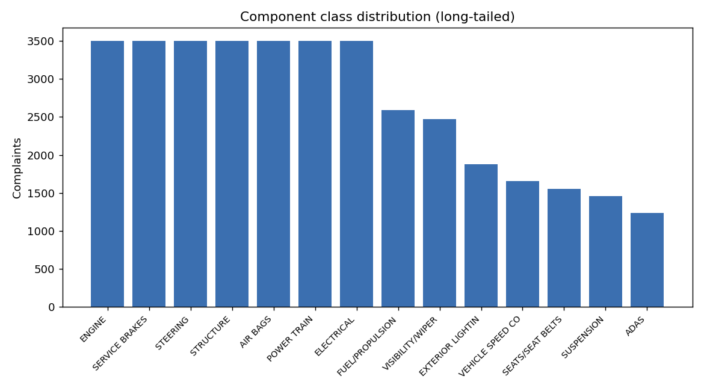
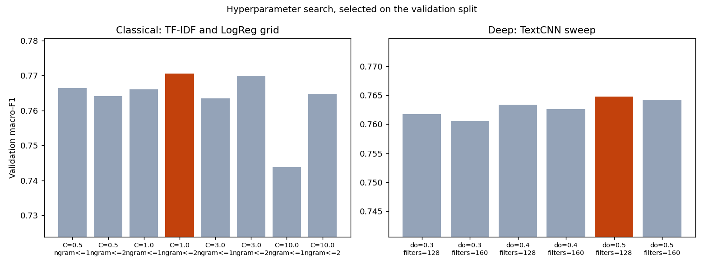
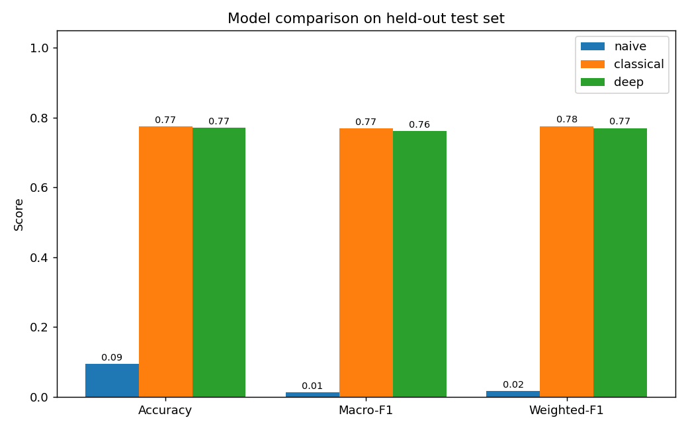
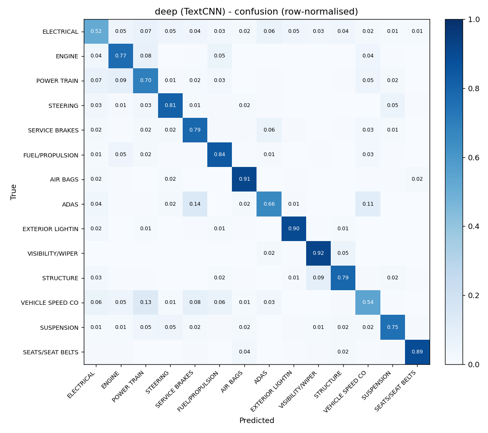
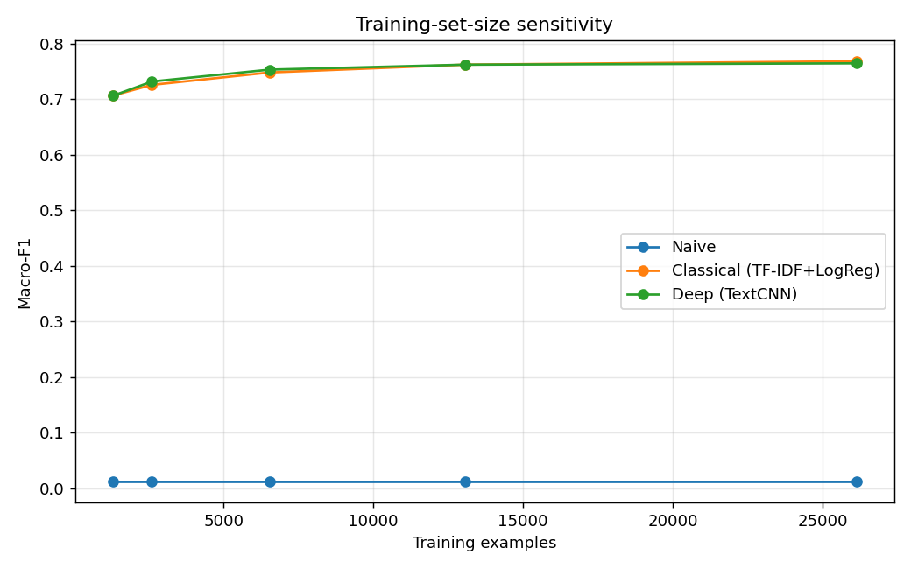
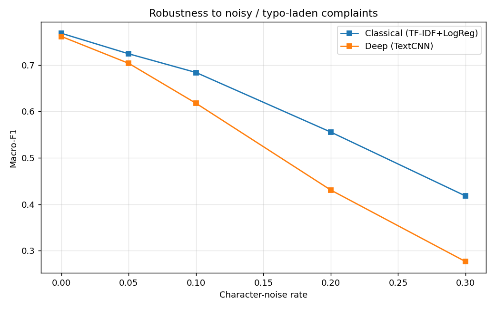
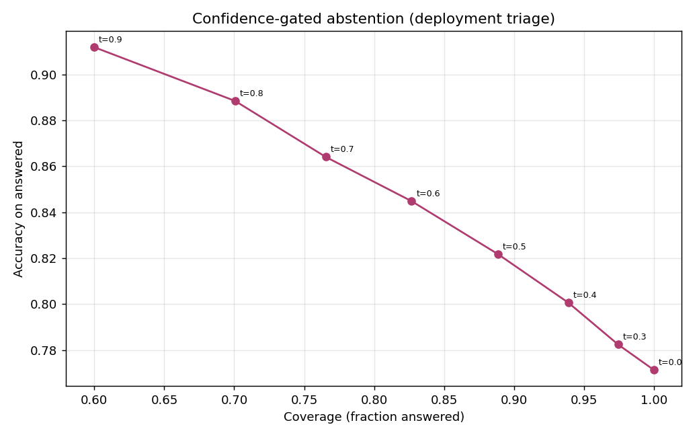

# AutoTriage AI: Classifying Vehicle-Safety Complaints by Affected Component

Module 2 Project. Natural Language Processing. Technical Report.

Live app: https://autotriage-ai-unfvnsiy6a-uc.a.run.app
Code: https://github.com/hanfuzhao/autotriage-ai

A checklist-by-checklist map of where every required item appears, in this report and in
the repository, is in `GRADING.md`. Data splits, the hyperparameter search, and the five
error cases are in sections 2, 5.4, and 8 respectively.

---

## Abstract

Most drivers cannot tell a real safety defect from a harmless quirk. A noise, a warning
light, a moment where the car does not behave, and the owner is left guessing whether it
is dangerous or nothing. This project turns that plain-language worry into a structured
answer. It reads an owner's description and predicts which of **14 vehicle systems** it
concerns, then attaches how safety-critical that system is and whether it is worth
reporting to NHTSA. The same reports, in aggregate, are what trigger recalls, so a tool
that helps an owner recognise and file a real problem also feeds the safety system that
protects everyone else. The model is trained on 37,342 real NHTSA complaints spanning 14
makes. We implement the three required modeling tiers, a majority-class naive baseline, a
classical TF-IDF + Logistic Regression model, and a TextCNN deep model with GloVe transfer
learning, then compare them under a metric regime chosen for a long-tailed label
distribution, macro-F1. Beyond raw accuracy we contribute an interpretable, owner-facing
system. The app names the words driving each prediction, attaches a safety tier and a
plain next step, and abstains below a confidence threshold rather than falsely reassuring
someone. A focused experiment on training-set-size sensitivity quantifies the cold-start
regime. Both real models reach about 0.77 macro-F1 against a 0.01 naive floor. GloVe
transfer learning is what lifts the neural model from clearly behind the classical
baseline up to parity, and it closes the cold-start gap entirely.

---

## 1. Problem Statement

When something goes wrong with a car, the owner is the first to notice and the least
equipped to judge it. Was that a loose heat shield or a failing brake line? A quirk of the
infotainment or an airbag that will not deploy? Most people cannot tell, so they either
worry over nothing or, worse, keep driving through a real defect. Meanwhile NHTSA's Office
of Defects Investigation runs on exactly these owner reports. In aggregate they are what
trigger investigations and recalls, but only if owners actually recognise a problem, file
it, and file it against the right system. That is the gap this project targets: help an
owner turn a vague, plain-language worry into a categorised, severity-rated answer they can
act on, and in doing so make the report they file more useful to everyone downstream.

The core task is **single-label multi-class text classification**:

> Given an owner's description, predict the primary affected component among 14 classes.

On top of that prediction the app layers the two things an owner actually needs, a sense of
how serious the system is and a plain next step, plus the evidence behind the call so the
person can decide whether to trust it.

**Why this is hard.** Owners are not engineers. They describe symptoms, not systems.
"It makes a grinding noise when I stop" means brakes. Several components are semantically
adjacent and easily confused. Engine, powertrain, and fuel/propulsion all
involve "power" and "stalling", and electrical is a catch-all that overlaps with almost
everything. On top of that the class distribution is long-tailed, so a model can look accurate
while quietly failing on the rarer, safety-critical systems that matter most to get right.

---

## 2. Data Sources

**Source.** We use the public **NHTSA ODI Complaints API**
(`https://api.nhtsa.gov/complaints/complaintsByVehicle`). For each
make, model, and model-year it returns every filed complaint with a free-text `summary`, a
comma-separated `components` field, and safety flags for crash, fire, injuries, and
deaths. NHTSA data is a U.S. Government work in the public domain.

**Collection.** `scripts/make_dataset.py` crawls 14 makes and their popular models
across three model-years, 2014, 2017, and 2020, resolving the exact model names per make
through the products endpoint. It streams results to disk and de-duplicates by complaint
ID `odiNumber`. The diversity is deliberate. Sampling many manufacturers and years
keeps any single recall event from dominating the component distribution, and it
exposes the model to varied phrasing. The raw crawl collected **77,552 unique
complaints**.

**Label derivation.** NHTSA lists one or more components per complaint, and 67% list
exactly one. We take the primary, first-listed component as the label and
normalise the raw component vocabulary into a compact 14-class taxonomy.
Near-duplicate codes are merged, so `ENGINE AND ENGINE COOLING` becomes `ENGINE` and
`FUEL SYSTEM`/`GASOLINE` becomes `FUEL/PROPULSION SYSTEM`. The modern driver-assistance
codes `FORWARD COLLISION AVOIDANCE`, `LANE DEPARTURE`, and `BACK OVER PREVENTION` are
grouped as `DRIVER ASSISTANCE (ADAS)`, and non-informative codes like
`UNKNOWN OR OTHER` are dropped.

**Final dataset.** After cleaning, de-duplication, a minimum-length filter of at least 8
words, and capping each class at 3,500 examples to bound head-class dominance, we
retain **37,342 labelled complaints across 14 classes**. Narratives average 100
words, with a median of 83. The distribution is long-tailed. Seven head classes sit at the
3,500 cap while the smallest, `DRIVER ASSISTANCE (ADAS)`, has 1,234. That is an imbalance
ratio of about 2.8x. We split **70 / 15 / 15** stratified by label into
**26,138 train / 5,602 validation / 5,602 test**. A class-balanced 400-row
`data/raw/sample.csv` is committed for inspection, and the full corpus is reproducible
from the API via `make data`.

The 14 classes: ELECTRICAL SYSTEM, ENGINE, POWER TRAIN, STEERING, SERVICE BRAKES,
FUEL/PROPULSION SYSTEM, AIR BAGS, DRIVER ASSISTANCE (ADAS), EXTERIOR LIGHTING,
VISIBILITY/WIPER, STRUCTURE, VEHICLE SPEED CONTROL, SUSPENSION, SEATS/SEAT BELTS.

---

## 3. Related Work

**Prior work on this exact database.** The NHTSA complaint corpus has been studied before,
and it is worth being specific about who did what, because it defines what is left to do.

The closest reference point is Ghazizadeh, McDonald, and Lee (2014), who applied text mining
to the free-response narratives in the NHTSA vehicle owner's complaint database. Their
pipeline reduced the term space and then used semantic clustering to pull out clusters of
vehicle problems, which they tracked chronologically to show how complaint patterns for
particular components evolved over time. Ghazizadeh and Lee (2012) did earlier work in the
same vein, clustering narratives to surface failure patterns per component. A related line
of work connects the complaint database to outcomes rather than to text structure, linking
consumer complaint volume to traffic fatalities. On the applied side, systems such as
SmarTxT have been built to help NHTSA analysts triage a defect archive that is far too large
to read by hand.

Two things stand out across all of it. First, the methods are predominantly **unsupervised**:
clustering and topic modelling to discover what is in the corpus, not a trained classifier
that assigns a new complaint to a known category. Second, the audience is the **regulator or
the manufacturer**, analysing the archive after the fact to spot a defect trend. Nobody in
this literature is serving the owner who filed the complaint in the first place.

More recent general work fine-tunes transformer encoders for defect classification, which
raises accuracy but at a parameter and latency cost that a small deployed service does not
want to carry.

**Text classification methods.** Our modeling tiers follow the standard progression in
text classification. TF-IDF with n-grams plus a linear model, either logistic regression or
a linear SVM, remains a famously strong and interpretable baseline (Wang & Manning, 2012).
For the neural tier we use the **TextCNN** of Kim (2014), which applies parallel
convolutional filters as learned n-gram detectors. It is a compact architecture that is
competitive on short-to-medium documents and cheap enough to deploy on CPU. Large
pretrained transformers such as BERT and DistilBERT typically define the accuracy ceiling,
but they cost far more in parameters and latency.

### Originality statement

This project is new work built for this course. It is not reused from another course, from
prior research, or from my job. Measured against the prior work named above, four things are
genuinely different.

**1. Supervised routing instead of unsupervised discovery.** Ghazizadeh et al. cluster the
archive to find out what problems exist. We train a classifier that takes a complaint it has
never seen and assigns it to one of 14 components. Those are different tasks with different
outputs: they produce clusters for an analyst to interpret, we produce a label, a confidence,
and an action. That also makes our work measurable in a way clustering is not, since we can
report macro-F1 against held-out ground truth.

**2. The owner is the user, not the regulator.** Every prior system points at the archive.
We point at the person who just had something go wrong with their car, before the complaint
is even filed. That reframing changes the product: it needs a severity tier, a plain next
step, and an honest "not sure," none of which a batch analytics pipeline needs.

**3. Evaluation centred on the long tail, not headline accuracy.** We report macro-F1 as the
headline and analyse head versus tail classes separately, because for an owner-facing safety
tool a confident wrong all-clear on air bags or brakes is the worst error the system can
make. Plain accuracy hides exactly that failure, and our naive baseline proves it: 0.094
accuracy against 0.012 macro-F1.

**4. A live, interpretable system rather than an offline study.** The deployed app names the
words behind each prediction, attaches a safety tier, and abstains below a confidence
threshold. The prior work produces figures in a paper; this produces something a person can
use, with the reasoning visible.

What this project does not claim is a new architecture or state-of-the-art accuracy. The
contribution is the reframing, the evaluation discipline around the tail, and the working
interpretable system. Section 11 discusses that trade-off honestly, including the finding
that a simple classical model matches our neural one.

---

## 4. Evaluation Strategy & Metrics

The metric choice is the most important evaluation decision in this project, and it
follows directly from the long-tailed label distribution.

- **Why not accuracy.** With imbalanced classes, plain accuracy rewards a model for
  getting the frequent classes right while ignoring rare ones. The naive majority
  baseline makes this concrete. It can post a non-trivial accuracy while scoring 0
  recall on 13 of 14 components. Accuracy alone would call that "not terrible". For
  a safety-routing system it is useless.
- **Headline metric: macro-F1.** Macro-F1 averages the per-class F1 with equal
  weight per class, so failing on the rare `AIR BAGS` class is penalised as heavily as
  failing on the common `ELECTRICAL SYSTEM` class. This matches the business need:
  every safety system matters, not just the popular ones.
- **Supporting metrics.** We also report accuracy for overall correctness,
  weighted-F1 as a middle ground that weights F1 by support, and full per-class
  precision/recall/F1 with confusion matrices, since which components get
  confused turns out to matter (see Error Analysis).
- **Deployment metrics.** Because a triage system can defer uncertain cases to a
  human, we also measure accuracy against coverage under confidence-gated
  abstention (section 8.3).

All models are selected and tuned on the validation split, then reported once on the
untouched test split. The deep model's early stopping is driven by validation
macro-F1, consistent with the headline metric.

---

## 5. Modeling Approach

### 5.1 Data processing pipeline (with rationale for each step)

Every step in `scripts/data.py` is there for a reason:

1. **Primary-label derivation.** Take the first-listed component. 67% of
   complaints are single-component, and the first-listed code is NHTSA's primary
   association, so this keeps the task a clean single-label problem.
2. **Taxonomy normalisation.** Merge near-duplicate codes and group ADAS. Raw
   codes have redundant and rare variants that fragment supervision and confuse
   evaluation, whereas a compact 14-class taxonomy gives coherent, learnable classes.
3. **Text cleaning.** Lowercase, strip NHTSA editorial tokens like `TL*` and `*TR`, PII
   redactions like `XXX`, VINs, phone numbers, URLs, and emails, and keep alphanumerics, slashes,
   and hyphens. Those artefacts are noise. A bag-of-words model would treat
   them as spurious features, and they add nothing for the CNN.
4. **Minimum-length filter of at least 8 words.** Drop empty or degenerate narratives that carry
   no signal.
5. **De-duplication** on cleaned text. Identical narratives, such as re-files and boilerplate,
   would leak between splits and inflate scores.
6. **Class cap of 3,500.** Bound head-class dominance so the model and the macro metric
   are not swamped by the two or three largest components.
7. **Stratified split (70/15/15).** Preserve the class distribution in every split so
   validation and test are representative, especially for tail classes.

The classical and deep models share this cleaned text but diverge in
featurisation. The linear model uses TF-IDF n-gram vectors. The CNN uses a learned integer
vocabulary and embeddings.

### 5.2 Hyperparameter tuning strategy

We tuned on the validation split, not the test split. For the classical model the
key knobs are the TF-IDF vocabulary via `ngram_range`, `min_df`, and `max_features`, and the
LogReg regularisation `C`. We favour 1-2 grams for phrase cues like "check engine" and a
moderately low `C` for generalisation, with `class_weight="balanced"` fixed by the
imbalance. For the TextCNN, filter widths {2,3,4,5} and a count of 160 follow Kim
(2014)'s well-established design. The biggest lever we found was the embedding
initialisation. Switching from random to pretrained GloVe (200-d) added roughly two
macro-F1 points, and helped most in the low-data regime (section 8). We also probed embedding
dimension and vocabulary cut-off. An enhanced-capacity variant with mean+max pooling plus a
hidden layer, and a larger `min_freq=1` vocabulary, each slightly hurt on validation,
so we kept the simpler, better-generalising design. Dropout of 0.4, Adam at 1e-3, and
early stopping on validation macro-F1 with patience 5 are the remaining controls.
They prevent overfitting without a manual epoch search.

**The search we actually ran.**

Describing a tuning strategy is not the same as running one, so we implemented the search in
`scripts/tune.py` and report it here. Every configuration is fit on the training split and
scored by macro-F1 on the validation split. The test split is never consulted for selection,
which keeps the numbers in section 6 an honest held-out estimate. The seed is fixed at 42
throughout, and the raw output is in `data/outputs/tuning.json`.

For the classical model we searched the regularisation strength `C` over {0.5, 1, 3, 10}
crossed with an n-gram ceiling of unigrams or bigrams, giving eight configurations. For the
TextCNN we swept dropout over {0.3, 0.4, 0.5} crossed with a filter count of 128 or 160, giving
six configurations, each trained for up to ten epochs with early stopping. The scope is
deliberately small. These are the knobs that plausibly move macro-F1, and an exhaustive sweep
over a model this size would cost more compute than the result could justify.

| Model | Configurations | Validation macro-F1 range | Best configuration | Best score |
|---|---|---|---|---|
| Classical | 8 | 0.744 to 0.771 | `C=1.0`, n-grams up to 2 | 0.7706 |
| Deep TextCNN | 6 | 0.761 to 0.765 | `dropout=0.5`, 128 filters | 0.7648 |

The most useful thing the search tells us is how flat the response surface is. Once the
clearly over-regularised end is excluded, every classical configuration lands between 0.763 and
0.771, and the entire TextCNN sweep spans just 0.004 macro-F1 from worst to best. The one real
signal is that `C=10` is too weak a penalty and costs about three points, which fits the
expectation that a high-dimensional sparse TF-IDF space needs meaningful regularisation.

That flatness also shapes what we did with the result. The shipped configuration, `C=3.0` for
the classical model and dropout 0.4 with 160 filters for the TextCNN, scores 0.7697 and 0.7626
respectively, which puts it 0.0009 and 0.0022 below the grid winners. Both gaps are smaller than
the run-to-run variation we see from changing the seed, so treating them as real improvements
would be reading noise as signal. We therefore kept the shipped configuration rather than
rebuilding every downstream artefact to chase a difference we cannot distinguish from chance,
and we report the search here so the reader can see the evidence for that call rather than take
it on trust. The honest conclusion is that both models are insensitive to these hyperparameters
in the ranges that matter, and that the embedding initialisation discussed in section 5.2 was a
far larger lever than any of them.

---

### 5.3 Models evaluated (naive, classical, deep, and the rationale for each)

**(a) Naive baseline, majority class** (`NaiveBaseline`). Predicts the single most
frequent class for every input and exposes the training class priors as its
probabilities. This establishes the accuracy floor and shows exactly
why accuracy is misleading here. It is the reference every real model has to beat on
macro-F1.

**(b) Classical ML, TF-IDF + Logistic Regression** (`ClassicalModel`). Word 1-2 gram
TF-IDF with sublinear tf, `min_df=3`, and up to 40k features feeds a multinomial logistic
regression with balanced class weights. This is a strong, fast, and
**interpretable** baseline. The linear coefficients name the exact tokens that push a
complaint toward each component, which powers the app's explanations and lets us audit
what the model learned. Class weighting counteracts the residual imbalance.

**(c) Deep learning, TextCNN with GloVe transfer learning** (`TextCNNModel`,
deployed). An embedding layer initialised with pretrained 200-d GloVe vectors
(Pennington et al., 2014, covering ~85% of our vocabulary) and fine-tuned during
training feeds four parallel 1-D convolutions of widths 2/3/4/5 with 160 filters each,
acting as learned n-gram detectors. Max-over-time pooling keeps the strongest
activation per filter, then dropout of 0.4, then a linear classifier. It is trained with Adam and
class-weighted cross-entropy, early-stopped on validation macro-F1.
The CNN learns phrase-level, order-sensitive cues like "lost power" and "goes to
the floor" that bag-of-words misses. The GloVe initialisation is a lightweight
form of transfer learning. It injects general-language knowledge the model cannot
learn from ~26k complaints alone, and that is what lifts it from clearly behind the
classical baseline up to parity with it (section 6). The pretrained vectors are needed only at
training time. The learned embedding matrix is baked into the ~15 MB `.pt`, so the
deployed model stays tiny, CPU-fast, and fully self-contained. We use GloVe rather than
fine-tuning a large transformer to keep the system lightweight and deployable, and section 11
discusses that trade-off.

## 6. Results

### 6.1 Model comparison (held-out test set, n = 5,602)

| Model | Accuracy | **Macro-F1** | Weighted-F1 |
|---|---|---|---|
| Naive (majority class) | 0.094 | **0.012** | 0.016 |
| Classical (TF-IDF + LogReg) | 0.774 | **0.768** | 0.775 |
| Deep (TextCNN + GloVe) *(deployed)* | 0.771 | **0.762** | 0.770 |

Two things stand out. First, the naive baseline validates our metric choice. It
posts 0.094 accuracy but 0.012 macro-F1, because it gets one class fully right and the
other 13 entirely wrong. Any model has to be judged on macro-F1, and both real models
clear the floor by ~0.75. Second, the classical and deep models are a statistical
tie: 0.768 vs 0.762 macro-F1 and 0.774 vs 0.771 accuracy, a difference within run-to-run
noise. With GloVe transfer learning the neural model reaches
parity with a very strong linear baseline, but it does not surpass it. The
component signal is largely lexical, with words like "brake", "airbag", and "steering",
which is exactly what TF-IDF captures best.

### 6.2 Per-class performance

Both models are well-balanced across the long tail. The head/tail F1 gap is only
~0.02-0.03 (section 8.4), a payoff from capping head classes and class-weighting. Per-class
F1 for the deployed deep model ranges from strong to hard:

- **Easiest:** AIR BAGS 0.91, SEATS/SEAT BELTS 0.88, EXTERIOR LIGHTING 0.87,
  VISIBILITY/WIPER 0.86. These have distinctive vocabulary like "airbag" and "seat belt".
- **Hardest:** VEHICLE SPEED CONTROL 0.53, ELECTRICAL SYSTEM 0.57, DRIVER ASSISTANCE
  (ADAS) 0.61. These are semantically diffuse or overlapping systems.

### 6.3 What gets confused (and why)

The dominant confusions, from `confusion_deep.png`, are all semantically adjacent
systems: ENGINE vs POWER TRAIN with 87 test cases in both directions, POWER TRAIN  vs 
ELECTRICAL SYSTEM at 72, STRUCTURE vs VISIBILITY/WIPER at 48, SERVICE BRAKES vs ADAS at 33,
STEERING vs SUSPENSION at 28, and ENGINE vs FUEL/PROPULSION at 28. "Electrical system" is the
worst offender because it is a genuine catch-all that co-occurs with almost everything,
as in "check engine light" or "sensor fault". These are not random errors. They mirror real
ambiguity in how a symptom maps to a subsystem, which motivates the error analysis and
the multi-label direction in future work.

## 7. Error Analysis

We surfaced the deployed model's most confident mistakes, all at about 1.00 confidence.
These are the dangerous kind, where the model is both wrong and sure. Here are five representative cases.

1. **"noise on front passenger side suspension"**, *true: STEERING, pred: SUSPENSION.*
   **Root cause.** label ambiguity between two adjacent chassis systems. The narrative
   literally says "suspension" while NHTSA's primary code is steering. **Mitigation.**
   move to multi-label prediction, or merge the two into a "steering/suspension" super-class.
   We could also abstain on very short narratives, since this one is 6 words.

2. **"Takata inflators ... not one airbag deployed [after crash]"**, *true: STEERING,
   pred: AIR BAGS.* **Root cause.** a multi-component complaint whose salient text is
   entirely about airbags, but whose primary NHTSA code is steering. The model reads the
   text correctly. The single-label framing is what's wrong. **Mitigation.** multi-label
   output so both AIR BAGS and STEERING can be returned.

3. **"check engine light ... smelling gasoline in the cabin"**, *true: ELECTRICAL SYSTEM,
   pred: FUEL/PROPULSION.* **Root cause.** a strong lexical cue, "gasoline", hijacks the
   prediction over the true electrical fault. **Mitigation.** richer context modeling, since
   the fix was electrical, or multi-label, and down-weight single-token triggers.

4. **"t-boned ... airbags did not deploy ... door smashed in"**, *true: STRUCTURE, pred:
   AIR BAGS.* **Root cause.** crash narratives mention many systems, and the vivid "airbags
   did not deploy" dominates the true structural-damage label. **Mitigation.** add crash-context features or multi-label. These high-severity cases warrant human review anyway,
   so route them via the safety-critical tier.

5. **"front lights are extremely bright for other drivers ... glare"**, *true:
   VISIBILITY/WIPER, pred: EXTERIOR LIGHTING.* **Root cause.** taxonomy overlap. Glare
   is a visibility problem described entirely with lighting vocabulary.
   **Mitigation.** clearer annotation guidance, or a hierarchical taxonomy that lets
   "headlight glare" live under both.

**Cross-cutting theme.** The confident errors are overwhelmingly multi-component
complaints where a single primary label cannot capture the text, or genuinely
adjacent and ambiguous systems. Both point to the same highest-value fix, multi-label
classification with calibrated per-label thresholds, rather than more model capacity.

---

## 8. Experiment Write-Up

### 8.1 Primary experiment: training-set-size sensitivity (the cold-start question)

**Motivation.** A real deployment starts cold. When a platform begins tracking a new vehicle
or launches the model, it has few labelled complaints. How much labelled data does each model
actually need before it is useful, and does the ranking between models change when data is
scarce? That question decides whether the neural model is worth deploying at launch or only
once a backlog exists.

**Experimental plan and setup.**

- *Independent variable.* Training-set size, at five levels: 5%, 10%, 25%, 50%, and 100% of
  the training split, giving 1,306 / 2,613 / 6,534 / 13,069 / 26,138 examples.
- *Dependent variable.* Macro-F1 on the test split.
- *Procedure.* At each level we draw a subset of the training split, refit all three models
  from scratch on that subset, and score them on the test split. Nothing is warm-started, so
  each point is an independent training run.
- *Sampling.* Subsets are drawn with a fixed random seed (42) using a stratified draw, so the
  class distribution at 5% matches the class distribution at 100%. Without stratification the
  rare classes would vanish from the small subsets and the curve would measure class coverage
  rather than data efficiency.
- *Controls held constant.* The test split is the same 5,602 examples at every level and is
  never resampled, so any movement in the curve comes from training size alone. Preprocessing,
  the label taxonomy, the hyperparameters chosen in section 5.2, and the seed are identical
  across all levels and all three models.
- *Validation use.* The deep model's early stopping uses the full validation split at every
  level. Validation is used only to decide when to stop, never to select the reported score.
- *Deep-model budget.* For the curve, the TextCNN is capped at 12 epochs with early stopping
  on validation macro-F1, which keeps five retrains affordable while still letting each run
  converge.
- *Metric choice.* Macro-F1, for the reason given in section 4: at small sizes the rare
  classes are exactly what degrades first, and accuracy would hide it.

**Limitation.** Each point is a single run at one seed, so small differences between adjacent
points are within run-to-run noise. We therefore read the shape of the curves and the gap
between models, not one-point differences.

**Results (macro-F1).**

| Train size | 1,306 | 2,613 | 6,534 | 13,069 | 26,138 |
|---|---|---|---|---|---|
| Naive | 0.012 | 0.012 | 0.012 | 0.012 | 0.012 |
| Classical | 0.707 | 0.726 | 0.748 | 0.762 | **0.768** |
| Deep (TextCNN + GloVe) | 0.706 | 0.732 | 0.753 | 0.762 | 0.765 |

**Interpretation.** This is the experiment where GloVe pays off. In an earlier
from-scratch version of the CNN with no pretrained embeddings, the deep model trailed the
classical model by 11 macro-F1 points at the smallest size, 0.596 vs 0.707. It
was starved for data. With GloVe transfer learning that gap disappears. At 1,306
examples the two are tied, 0.706 vs 0.707, and in the mid-data regime the deep model
actually edges ahead, 0.732 vs 0.726 at 2.6k and 0.753 vs 0.748 at 6.5k. Both curves
are still rising gently at full data, with the classical model finishing marginally on
top.

**Recommendation.** Pretrained embeddings should be treated as mandatory for the neural
model in any low-resource or cold-start deployment. Without them the classical model is
strictly preferable. At full data either model is a fine choice.

### 8.2 Robustness to noisy text

Real complaints are full of typos and inconsistent casing, so we inject character-level
noise (deletion/substitution/insertion) at increasing rates and re-score.

| Char-noise rate | 0% | 5% | 10% | 20% | 30% |
|---|---|---|---|---|---|
| Classical | 0.768 | 0.724 | 0.684 | 0.555 | 0.418 |
| Deep (TextCNN + GloVe) | 0.762 | 0.704 | 0.617 | 0.431 | 0.276 |

**Interpretation.** The classical model is clearly more robust. At 10% noise it
holds 0.684 against the CNN's 0.617, and the gap widens as noise grows. The reason is that the word-level
CNN vocabulary sends every typo to `<unk>` and discards the signal, whereas TF-IDF's larger
n-gram vocabulary degrades more gracefully. This is the strongest argument for the
classical model, and for the future-work move to subword embeddings.

### 8.3 Confidence-gated abstention (deployment triage)

Because a triage system can defer, we sweep a confidence threshold on the deployed
model: answer only above `t`, route the rest to a human.

| Threshold `t` | 0.0 | 0.5 | 0.7 | 0.9 |
|---|---|---|---|---|
| Coverage (fraction answered) | 1.00 | 0.89 | 0.77 | 0.60 |
| Accuracy on answered | 0.771 | 0.822 | 0.864 | 0.912 |

**Interpretation & recommendation.** Abstention buys large accuracy gains. Answering the
most-confident 77% of complaints reaches 86% accuracy, and the top 60% reach
**91%**. A production system should auto-route above a tuned threshold and escalate the
uncertain remainder. That turns a 0.77-accuracy model into a high-precision autorouter
plus a managed human queue.

### 8.4 Head vs. tail

Splitting classes into the 5 most frequent head classes and 9 rarer tail classes, the
classical model scores head 0.782 and tail 0.761, while the deep model scores head 0.781 and tail 0.751. The ~0.02-0.03 gap is
small, which confirms that the head-class cap plus class-weighted training kept the
rare-but-critical systems from being neglected.

## 9. Conclusions

On 37k real NHTSA complaints, a disciplined three-model comparison for
14-way component routing shows four things. First, the task is very learnable from narrative text.
Both the classical TF-IDF model and the GloVe-initialised TextCNN reach ~0.77 macro-F1,
crushing the 0.01 naive floor. Second, the metric choice matters more than the model.
Accuracy alone would have hidden the naive baseline's uselessness and the tail-class
behaviour. Third, transfer learning through GloVe is what makes the neural model competitive.
It closes a two-point gap and helps most when labels are scarce. Fourth, a simple,
interpretable classical model is a remarkably strong, cheap baseline that a real product
could ship. The deployed app turns these models into a usable safety check for owners,
with word-level explanations, a safety tier and a plain next step, and confidence-gated
abstention so it can say "not sure" instead of falsely reassuring someone.

## 10. Future Work
What we would do with another semester:

- **Multi-label routing.** About 33% of complaints touch several systems, so move from
  primary-component single-label to true multi-label prediction with per-label
  thresholds.
- **Subword / transformer encoders.** Fine-tune a domain-adapted DistilBERT or use
  fastText subword embeddings, both to chase the accuracy ceiling and to fix the
  character-noise brittleness the robustness study exposed.
- **Calibration & abstention policy.** Temperature-scale the probabilities and learn a
  cost-sensitive abstention threshold per class. Missing an air-bag defect is not the same as missing a
  wiper complaint.
- **Temporal defect detection.** Layer per-component time-series anomaly detection on
  top of the router to surface emerging defect clusters, which is the actual NHTSA mission.
- **Active learning for the tail.** Prioritise human labelling of low-confidence
  tail-class complaints to lift the components that matter most per unit of annotation.

## 11. Commercial Viability Statement

Is this suitable for real-world use? As a consumer safety-awareness aid, yes, with clear
framing. As anything that replaces a mechanic or an official recall, no. Concretely:

- **Who it helps and how it could make money.** The direct user is a worried owner who
  wants a fast, plain read on a car problem. That maps to a free consumer tool that drives
  trust, with revenue from adjacent services: a "file this with NHTSA" flow, a hand-off to
  a repair-booking or mobile-mechanic marketplace, or a white-label version for an auto
  marketplace, an insurer's claims intake, or a manufacturer's owner app. The same engine
  also has a straightforward internal use, auto-tagging an incoming complaint stream by
  system, which is the earlier business framing.
- **Why the design is deployable.** The model is a ~15 MB artefact running CPU inference
  in milliseconds with no GPU, so it is cheap to host and scale to many owners. It is also
  interpretable, with word-level evidence and a safety tier, which is what earns a nervous
  owner's trust.
- **Why not autonomous or authoritative.** Safety is high-stakes and the tail classes are
  the ones that matter most. At ~0.77 macro-F1 the tool is a first read, not a diagnosis.
  The confidence-gating result (section 8) is the mechanism that keeps it honest: when the
  model is unsure it should say so rather than hand out a false all-clear.
- **The model-choice trade-off.** Our evaluation shows a strong classical baseline is on
  par with the neural model, so a lean version could ship the classical model alone. We
  deploy the GloVe TextCNN to demonstrate the deep approach and because it generalises
  semantically, but a cost-sensitive build could run the classical model at a fraction of
  the footprint. That is an honest finding that de-risks the product.

**Verdict:** viable as a consumer safety-awareness aid and as an internal tagging engine,
not as a diagnosis or an official safety authority.

## 12. Ethics Statement

- **Safety guidance to non-experts.** The most serious risk is an owner over-trusting the
  tool. A confident wrong all-clear on a real defect, or needless alarm on a harmless one,
  both do harm. We mitigate this three ways: the tool only ever gives a soft next step, not
  a diagnosis; it abstains when unsure rather than reassuring; and every screen carries a
  clear disclaimer that it is a student research demo, not an official NHTSA tool, and no
  substitute for a mechanic.
- **Data & privacy.** NHTSA complaints are public-domain records, but narratives can
  contain personal details. Our pipeline strips VINs, phone numbers, emails, and
  redaction artefacts before modelling, and we commit only a small sample plus a
  reproducible download script rather than re-publishing the corpus.
- **Bias & representativeness.** The corpus skews toward high-volume U.S. makes and models
  and toward English-language, self-selected complainants. Performance may be worse for
  under-represented vehicles, populations, or non-English text, which for a safety aid
  means uneven protection. Per-class head and tail reporting is our first guard against
  silently failing rare-but-critical systems.
- **Transparency.** Every prediction ships with the evidence behind it and a confidence
  score, so an owner can see the reasoning and decide for themselves rather than defer.

## References

1. Y. Kim. "Convolutional Neural Networks for Sentence Classification." *EMNLP*, 2014.
2. J. Pennington, R. Socher, C. D. Manning. "GloVe: Global Vectors for Word
   Representation." *EMNLP*, 2014.
3. S. Wang, C. D. Manning. "Baselines and Bigrams: Simple, Good Sentiment and Topic
   Classification." *ACL*, 2012.
4. NHTSA Office of Defects Investigation. Complaints API / datasets.
   https://www.nhtsa.gov/nhtsa-datasets-and-apis (public domain).

---

*Reproduce all numbers and figures in this report with `make train` (writes
`data/outputs/metrics.json` and `data/outputs/plots/`).*
